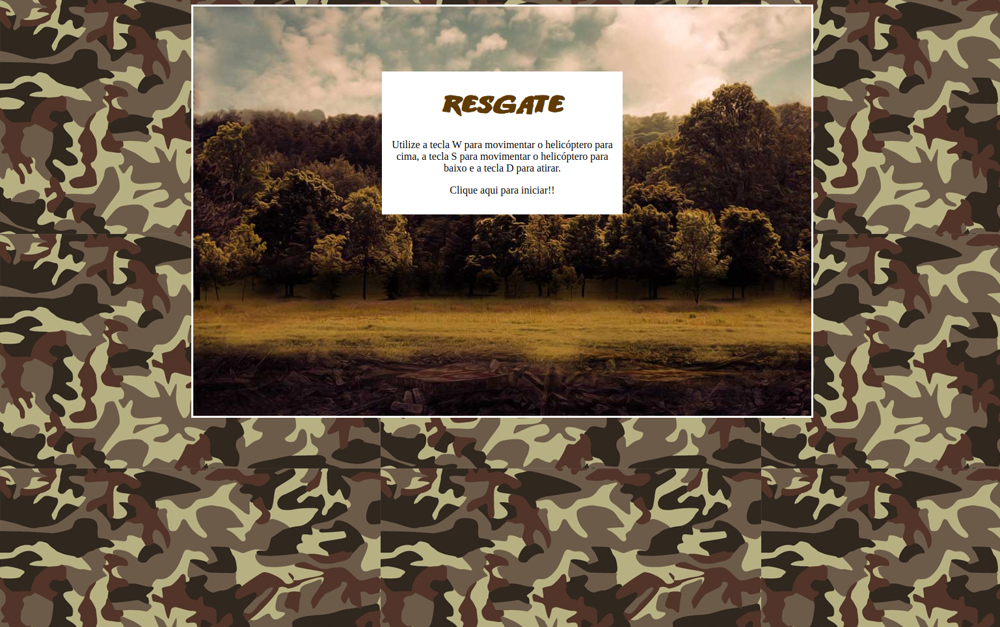
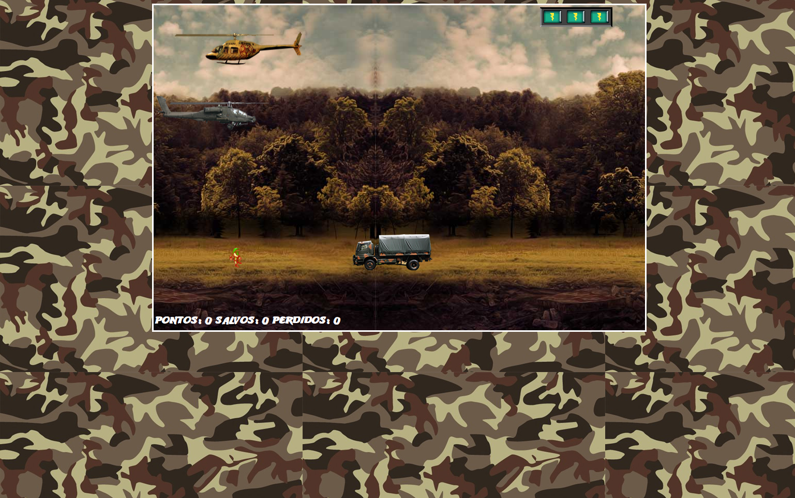

# jogo-nave

<h1 align="center">Construindo primeiro jogo de naves Digital Innovation One</h1>

Curso do Bootcamp Take Blip Web Developer da <a href="https://web.dio.me/home" target="_blank">Digital Innovation One</a>

 <a href="#objetivo">Objetivo</a> •
 <a href="#preview">Preview</a> •
 <a href="#tecnologias">Tecnologias utilizadas</a> • 
 

<h3 id="objetivo">🔖 Objetivo</h3>

🚀 O projeto desenvolvido é um desafio para o Curso do Bootcamp Take Blip Web Developer da <a href="https://web.dio.me/home" target="_blank">Digital Innovation One</a>, cujo objetivo é criar um jogo de nave com HTML, CSS e JavaScript.

  <h3 id="preview">Screenshots das telas</h3>
  <h2>:camera_flash: Tela 1</h2>
  
    
    <h2>:camera_flash: Tela 2</h2>
  

<h3 id="tecnologias">⚡ Tecnologias utilizadas</h3>

- HTML5
- CSS3
- JavaScript
- Jquery
- Jquery Collision
